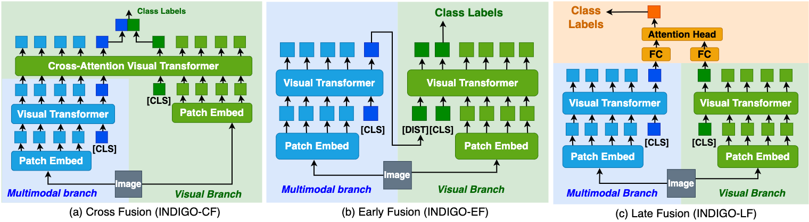
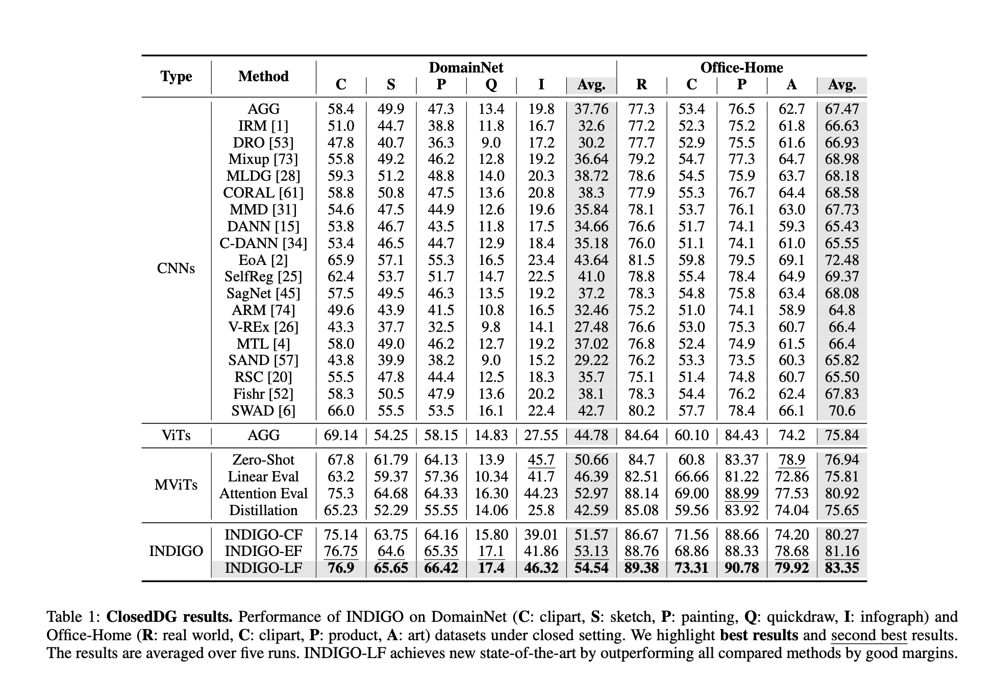
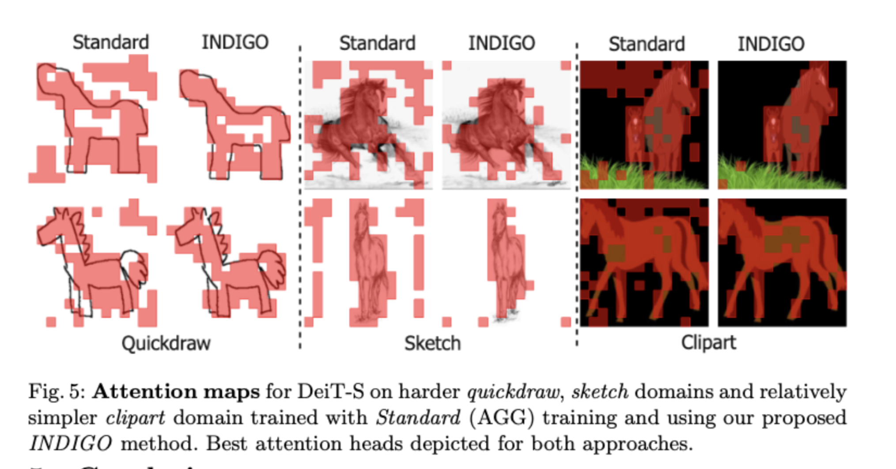
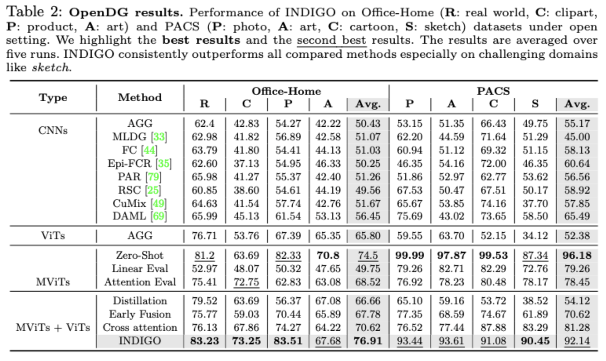
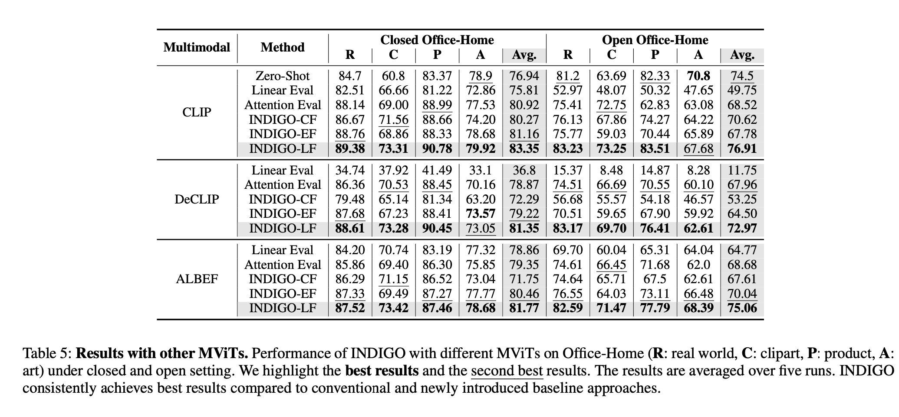
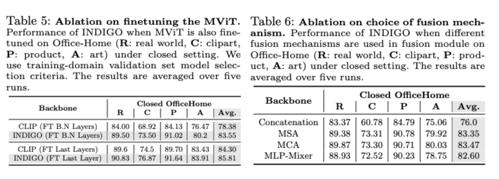
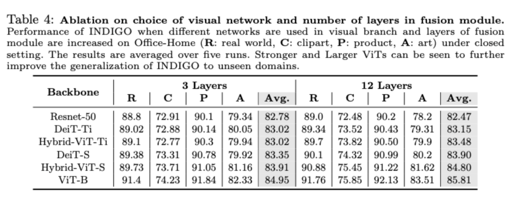

# INDIGO: Intrinsic Multimodality for Domain Generalization (ECCV'22- OOD-CV Workshop)

Puneet Mangla*,
Shivam Chandhok*,
Milan Aggarwal,
Vineeth N Balasubramanian,
Balaji Krishnamurthy (*Equal Contribution)

**[Paper Link](https://arxiv.org/abs/2206.05912)** 


> **Abstract:**
>*For models to generalize under unseen domains (a.k.a do- main generalization), it is crucial to learn feature represen- tations that are domain-agnostic and capture the underlying semantics that makes up an object. Recent advances towards weakly supervised vision-language models (such as CLIP) have shown their ability on object understanding by captur- ing semantic characteristics that generalize under different domains. Hence, it becomes important to investigate how the semantic knowledge present in their representations can be effectively incorporated and utilized for domain generaliza- tion. Motivated from this, we study how semantic informa- tion from existing pre-trained multimodal networks can be leveraged in an ”intrinsic” way to make systems generalize under unseen domains. We propose IntriNsic multimodality for DomaIn GeneralizatiOn (INDIGO), a simple and elegant framework that leverages the intrinsic modality present in pre-trained multimodal networks to enhance generalization to unseen domains at test-time. We experiment on several Do- main Generalization settings (ClosedDG, OpenDG, and Lim- ited sources) and show state-of-the-art generalization perfor- mance on unseen domains. Further, we provide a thorough analysis to develop a holistic understanding of INDIGO.*


<p align="center">
  
</p>


## Usage & Data
Refer to `requirements.txt` for installing all python dependencies.
Install CLIP
```pip install ./CLIP```


### Arguments: 
```--target <Target Domain>```
```--name <Name of experiment>```
```--model <Backbone model>```
```--teacher <Teacher model >```

### Class Token Distillation Training Approach
```CUDA_VISIBLE_DEVICES=2,3 python main.py --dg --target clipart  --config_file configs/zsl+dg/clipart.json --dataset domainnet   --name test  --runs 5 --method class_token_distill --model vit_small_hybrid --teacher clip_vit_b ```

### DeiT Distillation Training Approach
Load teacher model using main.py and then run
```CUDA_VISIBLE_DEVICES=2,3 python main.py --dg --target clipart  --config_file configs/zsl+dg/clipart.json --dataset domainnet   --name test  --runs 5 --method distill --model vit_small_hybrid ```

### Standard Training Approach
```CUDA_VISIBLE_DEVICES=2,3 python main.py --dg --target clipart  --config_file configs/zsl+dg/clipart.json --dataset domainnet   --name test  --runs 5 --method standard --model vit_small_hybrid```
## Results
Results of our proposed method INDIGO on Domain Generalization and OpenDG along with attention visualizations and analysis

<strong>Domain Generalization (ClosedDG)</strong> performance of INDOGO in comparison with state-of art Domain Generalization methods on DomainNet and Office-Home Datasets.



<hr />
<strong> Attention Visualizations</strong>



<hr />



<strong>Open Domain Generalization (ClosedDG)</strong> performance of INDOGO in comparison with state-of art Domain Generalization methods on DomainNet and Office-Home Datasets.

<hr />




<hr />




<hr />




<hr />


## Citation

```bibtex
@inproceedings{indigo,
    title={INDIGO: Intrinsic Multimodality for Domain Generalization}, 
    author={P Mangla and S Chandhok and M Aggarwal and VN Balasubramanian and B Krishnamurthy},
    booktitle={ECCV'22- OOD-CV Workshop},
    month = {June},
    year={2022}
  }
```


## Acknowledgements
Our code is based on [DINO](https://github.com/facebookresearch/dino) and [TimeSformer](https://github.com/facebookresearch/TimeSformer) repositories. We thank the authors for releasing their code. If you use our model, please consider citing these works as well.


